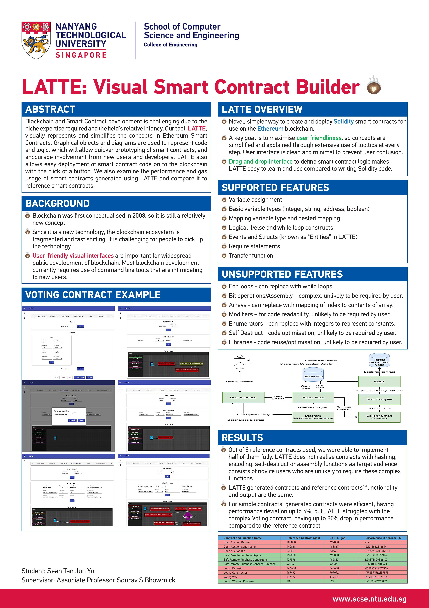

# LATTE: Visual Smart Contract Builder

LATTE is a graphical user interface tool that makes it easy for both developers and non-developers to create and deploy smart contracts. It uses a drag and drop interface to simplify the task of creating smart contracts, and it helps users to compile and deploy smart contracts onto the blockchain.

Uses electron, react, solc and web3. Material-UI is used to style the application.

## To run:
- yarn - installs all packages and dependencies
- yarn dev - runs the application in development mode (with the console available)
- yarn start - runs the application in production mode
- yarn test - runs tests and generates test coverage report
- yarn package - package application for current environment into the release directory
- yarn package-all - package application for Windows, Linux and MacOS into the release directory
